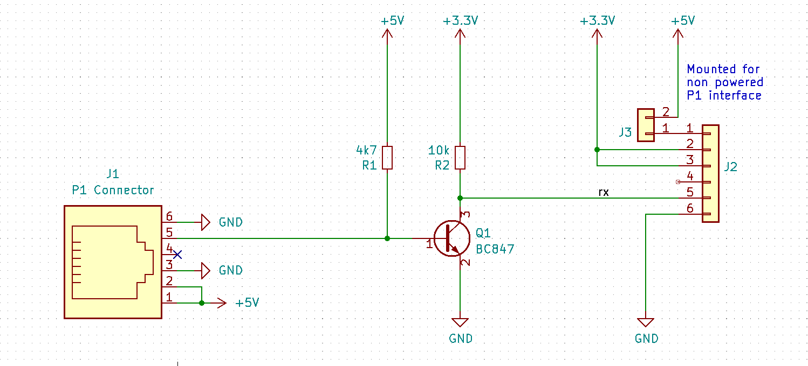
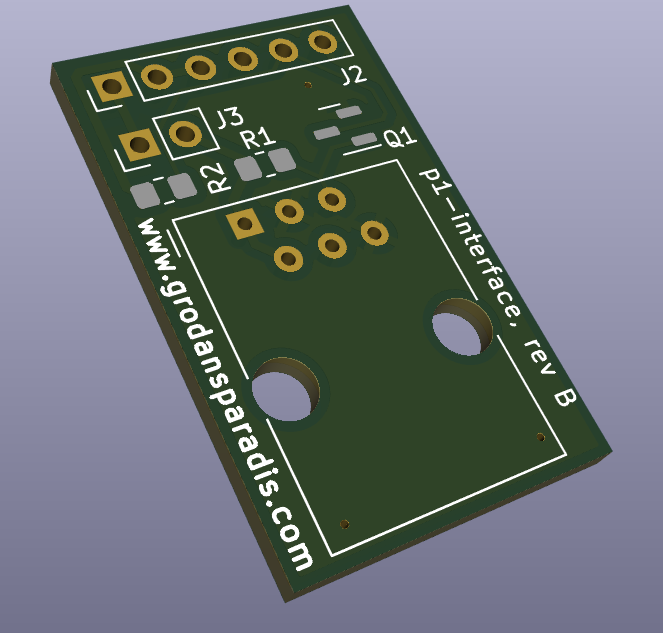
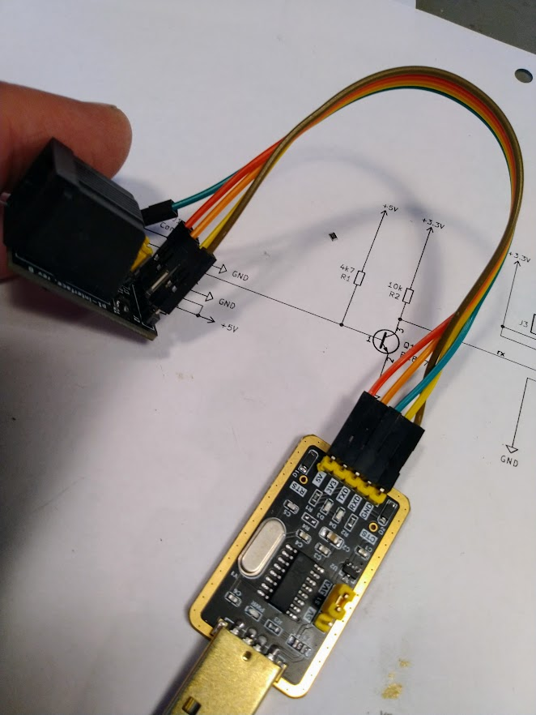
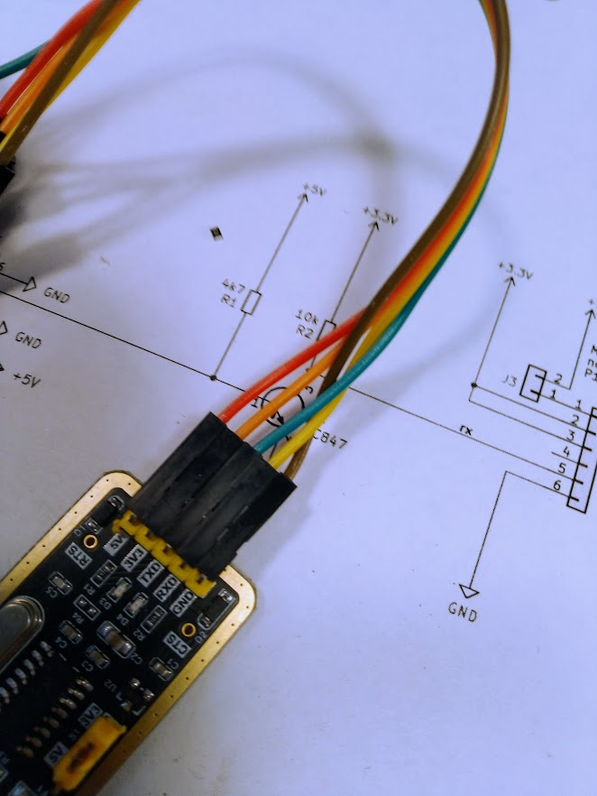
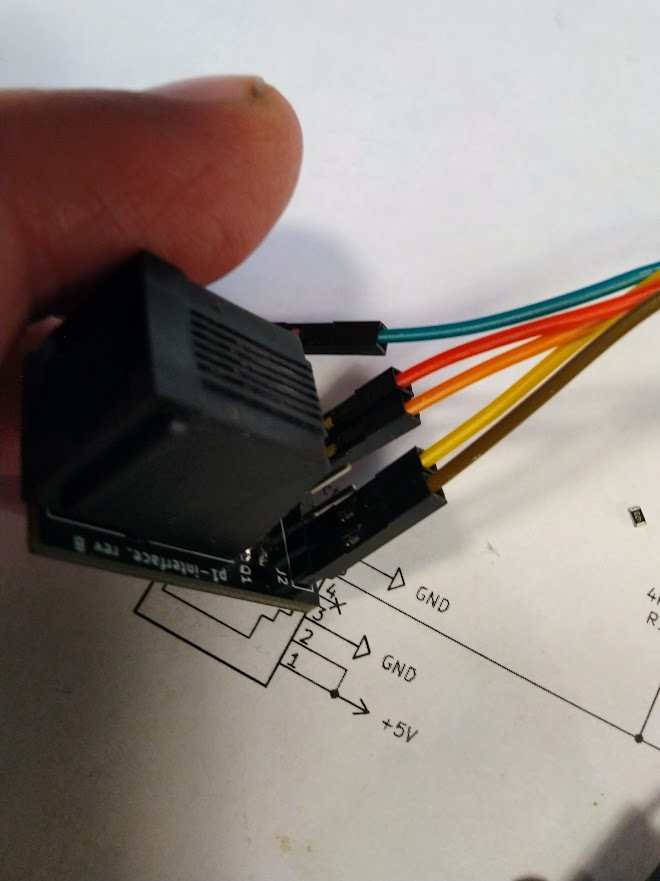
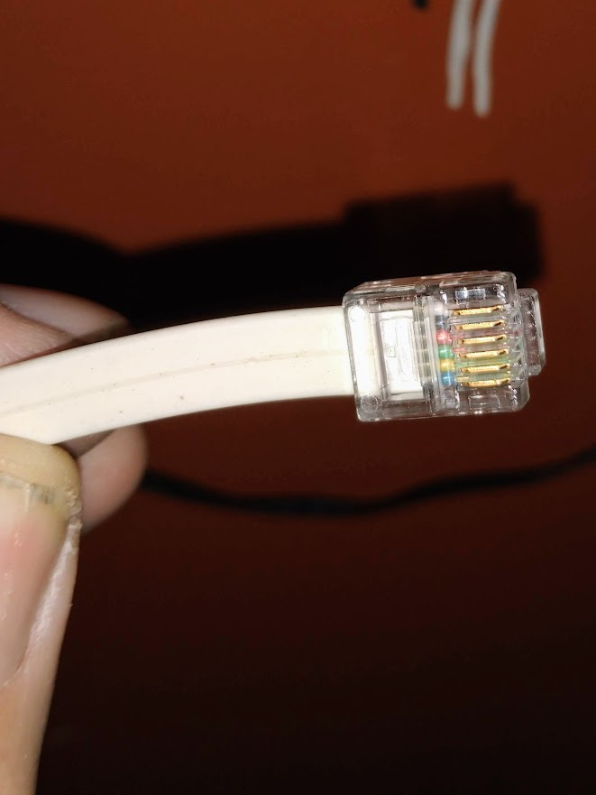
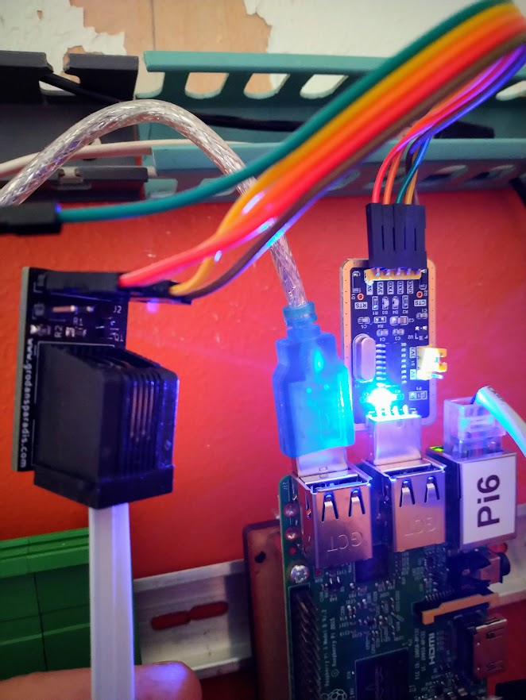

# vscp-p1-HAN-interface 

HAN P1 interface for smart meters to serial TTL. Should work with

| Meters |
| ------  |
| Sagemcom T211 / Ellevio & Skånska Energi |
| Landis+Gyr E360 |
| Itron A300 / Borås Elnät <
| S34U18 (Sanxing SX631) / Vattenfall |
| KAIFA MA304H4E / Nacka Energi |
| KAIFA CL109 / Öresundskraft |
| and more. |

There is a description [here](https://grodansparadis.com/wordpress/?p=5039) about my setup. 

The PCB, [assembled](https://frogshop.se/product/kort-for-han-p1-ttl-serieinterface-monterat/?v=f003c44deab6) or [bare](https://frogshop.se/product/kort-for-han-p1-ttl-serieinterface-omonterat/?v=f003c44deab6), can be bought from https://frogshop.se/  

Bare PCB or mounted PCB is available from THE VSCP shop.

Interface card for P1 based smartmeter to TTL serial interface.  

## BOM

| Component | Description |
| --------- | ----------- |
| R1 | Resistor 4.7K 0805 |
| R2 | Resistor 10K 0805 |
| T1 | NPM Transistor BC847 |
| J1 | RJ11 Modular connector (Amphenol 54601 or similar) |
| J2 | 6-pin pinheader 2.54 pitch |
| J3 | 2-pin pinheader 2.54 pitch |

## J3 

Strap pins t use if the HAN interface does not provide power by itself.

## J2 Connections

| Pin | Description |
| --- | ----------- |
| 1 | +5V |
| 2 | +3.3V or 5V * |
| 3 | +3.3V or 5V * |
| 4 | Not Connected |
| 5 | RX (Received data TTL level) |
| 6 | GND |

* Use same power on 2/3 as the serial interface the unit is connected to.

## Connecting 

To connect the interface to a HAN P1 port a serial TTL interface is needed. We describe using an [USB to serial adapter](https://frogshop.se/product/usb-ttl-serial-adapter/?v=f003c44deab6) here but an Arduino or ESP8266/32 or similar can also be used.

First connect the interface to the serial adapter

| Interface | TTL adapter |
| --------- | ----------- |
| 1 | +5V |
| 2 | 3.3V |
| 3 | Not connected or 3.3V |
| 4 | Mot connected |
| 5 | RX |
| 6 | GND |

The following two pictures mau be clearer

Now draw a standard six leads RJ12 cable from the HAN port of the meter and connect it to the interface. 

The cable should have the same colors on both connectors (straight cable). Like this

It is OK to use a cable of a few meters. At least if you are in an environment without to much electric disturbance.

Now connect the TTL USB adapter to the serial port. The blue LED should light up on the USB TTL serial adapter. 

If everything is correct the red RX LED will light up every ten seconds to show that data is received.

Now you are ready to go. More info is [here](https://grodansparadis.com/wordpress/?p=5039) on how to proceed.

