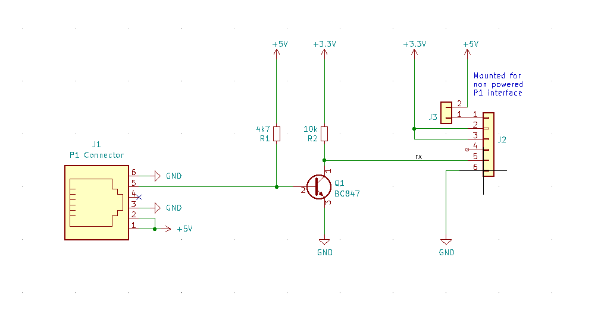
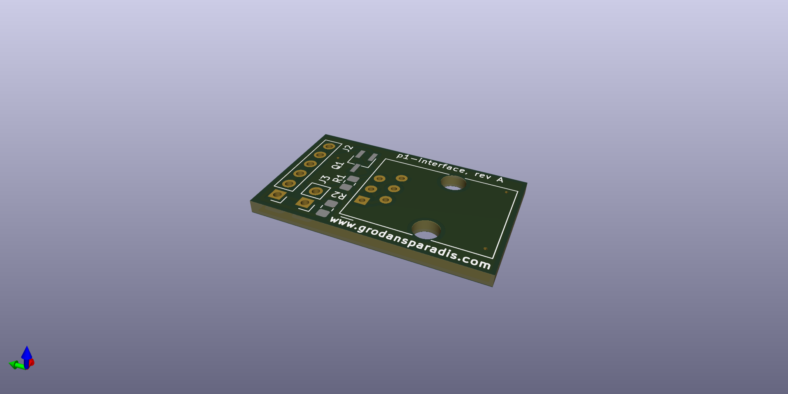

# vscp-p1-pulse-interface 

HAN P1 interface for smart meters to serial TTL.

The PCB, assembled or bare, can be bought from http://www.grodansparadis.com

Interface card for P1 based smartmeter to TTL serial interface.  

